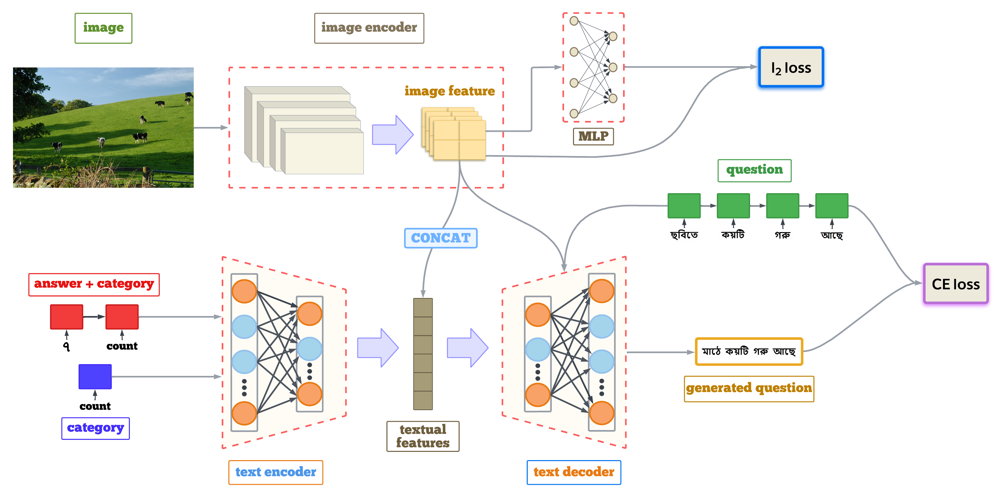

# Visual Question Generation in Bengali




This repository contains code used to produce the results in the following paper:

### [Visual Question Generation in Bengali](https://aclanthology.org/2023.mmnlg-1.2/) </br>
Proceedings of the Workshop on Multimodal, Multilingual Natural Language Generation and Multilingual WebNLG Challenge ([MM-NLG 2023](https://synalp.gitlabpages.inria.fr/mmnlg2023/)).


We propose the **first Bengali Visual Question Generation task** and develop a novel transformerbased encoder-decoder architecture that generates questions in Bengali when given an image.

**Here's a [video](https://youtu.be/kvNlsLVDYzA) where I explain our paper.** 

If you are using this repository, please use the following citation:

```
@inproceedings{hasan-etal-2023-visual,
    title = "Visual Question Generation in {B}engali",
    author = "Hasan, Mahmud  and
      Islam, Labiba  and
      Ruma, Jannatul  and
      Mayeesha, Tasmiah  and
      Rahman, Rashedur",
    editor = "Gatt, Albert  and
      Gardent, Claire  and
      Cripwell, Liam  and
      Belz, Anya  and
      Borg, Claudia  and
      Erdem, Aykut  and
      Erdem, Erkut",
    booktitle = "Proceedings of the Workshop on Multimodal, Multilingual Natural Language Generation and Multilingual WebNLG Challenge (MM-NLG 2023)",
    month = sep,
    year = "2023",
    address = "Prague, Czech Republic",
    publisher = "Association for Computational Linguistics",
    url = "https://aclanthology.org/2023.mmnlg-1.2/",
    pages = "10--19",
    abstract = "The task of Visual Question Generation (VQG) is to generate human-like questions relevant to the given image. As VQG is an emerging research field, existing works tend to focus only on resource-rich language such as English due to the availability of datasets. In this paper, we propose the first Bengali Visual Question Generation task and develop a novel transformer-based encoder-decoder architecture that generates questions in Bengali when given an image. We propose multiple variants of models - (i) image-only: baseline model of generating questions from images without additional information, (ii) image-category and image-answer-category: guided VQG where we condition the model to generate questions based on the answer and the category of expected question. These models are trained and evaluated on the translated VQAv2.0 dataset. Our quantitative and qualitative results establish the first state of the art models for VQG task in Bengali and demonstrate that our models are capable of generating grammatically correct and relevant questions. Our quantitative results show that our image-cat model achieves a BLUE-1 score of 33.12 and BLEU-3 score of 7.56 which is the highest of the other two variants. We also perform a human evaluation to assess the quality of the generation tasks. Human evaluation suggests that image-cat model is capable of generating goal-driven and attribute-specific questions and also stays relevant to the corresponding image."
}
```

## Disclaimer

This public release may contain errors, but I will work on correcting them gradually.

## Environment Setup

- Clone this repository. 
- Using the environment.yml file install the dependencies.

## Download Dataset

We translated the [VQA v2.0](https://visualqa.org/download.html) in Bengali. We maintained the same partitioning as the original dataset. Due to computational
constraints we translated a smaller subset of the
training and the validation set. We translate the
initial 220K questions and answers for training and
150K questions and answers for validation set.

To download the dataset in Bengali, Visit [Here](https://drive.google.com/drive/folders/1cp_cip_-WOK2NEcl4HES8QCGwdpFphJm?usp=sharing).

## Getting Up and Running:

### Word Vectors
Download and extract GloVe and bengali pretrained vectors to the vectors directory. For your convenience, you can find them here:
- [glove.6B.300d](https://www.kaggle.com/datasets/thanakomsn/glove6b300dtxt)
- [bn_glove.39M.300d](https://github.com/sagorbrur/GloVe-Bengali)

For better understanding, refer to `train_iq.py` for the set of arguments the model and code will take.

### Creating Dataset

To train and test models, you will need to prepare separate datasets in hdf5 file format. The default directory for data is `data/vqa` and `data/processed`

***It is very important that you look in to the `utils` module to better understand what parameters and arguments the code is taking AND structure your project according to that or build an intuition about how the code is working.***
 
Refer to `create_dataset.py` to clear any confusions on how to build the dataset.

```shell
# Create the vocabulary file.
python utils/vocab.py

# Create the hdf5 dataset. You'll need to create separate train and validation datasets
python utils/create_dataset.py

```

This will create a vocabulary object, an hdf5 dataset compiled with images, questions and answers and answer categories.


### Model Training

To train and test the model, run these scripts. The results will be saved in the `Results/` directory. Model checkpoints and logs along with their hyperparameters will be saved in `lightning_logs/` directory.

```shell
# Train the model.
python train.py

# Test the model.
python test.py
```

## Results


Our quantitative and qualitative analyses establish the first state-of-the-art models for the VQG task in Bengali, demonstrating that the proposed systems are capable of generating both grammatically sound and contextually relevant questions. In particular, the image-cat model attains a BLEU-1 score of 33.12 and a BLEU-3 score of 7.56, outperforming the alternative variants. To further assess generation quality, we conducted a human evaluation, which indicates that the image-cat model consistently produces goal-driven and attribute-specific questions while maintaining strong alignment with the corresponding images.

